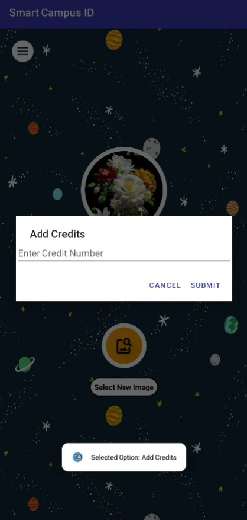

# Smart Campus ID System 🚀  

  

The **Smart Campus ID System** is a cutting-edge solution designed to enhance student identification, attendance tracking, and campus security using **NFC, GPS, and mobile payment systems**. This all-in-one platform streamlines administrative tasks and improves student safety while ensuring seamless operations.  

  

## 🔥 Features  

### 🎓 Student Features  
- **NFC-Based ID Cards** 📲 for secure student authentication.  
- **Automated Attendance Tracking** ⏳ using NFC readers and GPS.  
- **Cashless Transactions** 💳 with integrated campus payment systems.  
- **GPS Location Monitoring** 📍 for real-time student tracking.  
- **Mobile App** 📱 for attendance, payments, timetable access, and complaint filing.  

### 🏛️ Administrator Features  
- **Real-Time Attendance Reports** 📊 for improved tracking and analytics.  
- **Access Control System** 🚪 for restricted campus areas.  
- **Centralized Student Database** 🗂️ for better student management.  
- **Automated Refunds & Credit-Based Payments** 💰 for seamless transactions.  

## 📲 Download APK  

Click the button below to download the latest version of **Smart Campus ID System**:  

  

## 📸 Screenshots  

### Splash Screen
 

### Start Screen
 

### Student Login
 

### Student Registration
 

### Employee Login
 

### Employee Registration
 

### Parent Login
 

### Vendor Login
 

### Vendor Registration
 

### Student Dashboard
 

### Options for Students
 

### Geo Tagged Attendance
 

### Options for Proctor
 

### Hostel Services
 

### Apply New Leave
 

### Leave Histories
 

### Leave History Status
 

### Payment History
 

### Attendance History
 

### RFID Based Attendance System
 

### Credit Options
 

### Request for Credit Addition 
 

### Credit History
 

### Employee Dashboard
 

### Parent Dashboard
 

### Student Attendance History
 

### Student Payment History
 

### Vendor Dashboard
 

### Proctor approve or decline credit request
 

## 🛠️ Tech Stack  
- **Programming Language**: Java  
- **Android SDK & Firebase**  
- **GPS & NFC Technologies**  
- **Cloud Storage for Student Data**  
